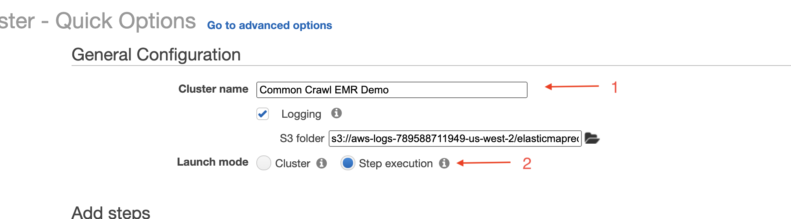

## EMR Tutorial
This guide walks you through submitting a Scala Spark job to EMR that queries 500k job urls from Common Crawl and stores the result in an S3 bucket as CSV.

### Prerequisites
This isn't required, but I highly reccomend this 6 minute intro to EMR. It's the simplest EMR hello world you could ask for

https://www.youtube.com/watch?v=gOT7El8rMws&ab_channel=JohnnyChivers

### S3 Setup
You'll need to create two S3 buckets for this tutorial, an "input" bucket and an "output" bucket.
You'll use the "input" bucket to upload your Spark application jar file. 
The "output" bucket will store the output data produced by your application.

I named my two buckets `input-bucket-revusf` and `output-bucket-revusf`

```shell
s3cmd mb input-bucket-revusf
s3cmd mb output-bucket-revusf
```

I'm going to use `s3cmd` for throughout this guide, but feel free to use AWS-cli or the S3 console.





 
