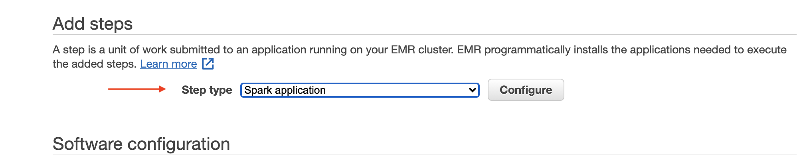

## EMR Tutorial
This guide walks you through submitting a Scala Spark application to EMR that queries 500k job urls from Common Crawl and stores the result in an S3 bucket as a CSV file.

Running the application on EMR will cost about 35 cents

### Prerequisites
This isn't required, but I highly reccomend this 6 minute intro to EMR. It's the simplest EMR hello world you could ask for

https://www.youtube.com/watch?v=gOT7El8rMws&ab_channel=JohnnyChivers

### S3 Setup
Create two new S3 buckets.
The first will used be to upload your Spark application jar file. 
The second will store the output data produced by your application.
I'll refer to these as your "input" and "output" buckets.

I named my two buckets `input-bucket-revusf` and `output-bucket-revusf`

```shell
s3cmd mb input-bucket-revusf
s3cmd mb output-bucket-revusf
```

I'm going to use `s3cmd` for throughout this guide, but feel free to use AWS-cli or the S3 console.

### Clone the Repo
We're going to build our application jar locally then submit it to EMR so we'll need to clone this repo

```shell
git clone https://github.com/haydenhw/commoncrawl-emr-tutorial
```
```shell
cd commoncrawl-emr-tutorial
```
### Update the output bucket name
You'll need to modifiy one line of the application Runner to tell Spark where to find the "output" bucket you created earlier.

Replace YOUR-BUCKET-NAME with the name of your output bucket at the line shown below.


Since I named my output bucket `output-bucket-revusf` the string would become "s3a://output-bucket-revusf"

### Create a jar file
Now simply build the application as usual with sbt assembly:

`sbt assembly`

*Note: If you try to run this locally it will fail. I've ommitted the dependencies needed to connect to S3 locally to minimize the size of the jar file*

### Upload jar file
Once sbt assembly completes we need to upload our jar file to the "input" bucket we created earlier in S3.

```shell
s3cmd put target/scala-2.11/commoncrawl-emr-demo-assembly-0.1.0-SNAPSHOT.jar s3://input-bucket-revusf
```


*Note: If you're uploading your jar file using the S3 console and it's taking a long time, try a CLI tool instead. I've found that to be much faster*

### Create an EMR Cluster
Now open the AWS EMR conosole in your browser and click the **Create cluster** button


# Name Cluster and set Launch Mode
Give your cluster a name then click the **Setup execution** option for **Launch mode**

Step execution will automatically terminate the cluster after our application completes. This is nice beacause we won't need to worry about accidentally leaving the cluster running an racking up charges when we aren't using it.




# Configure your Spark application


# Create Cluster


# Monitor your step


# Check on your application progress


# Download you output data


 
